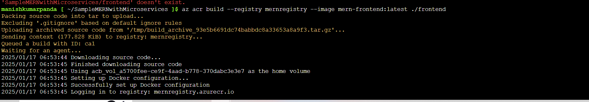
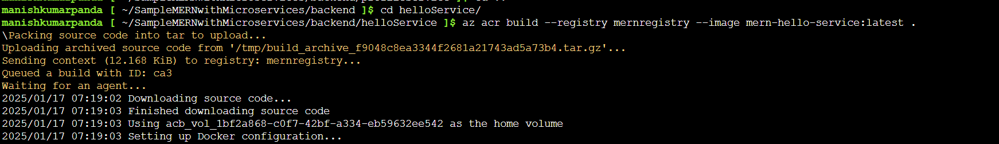
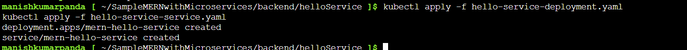
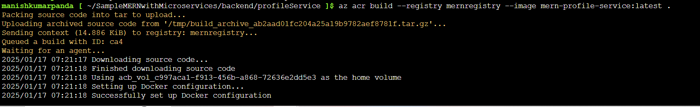
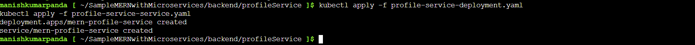

# Deploying a MERN Application on Azure Kubernetes Service (AKS)

This guide outlines the step-by-step process to deploy a MERN stack application on Azure Kubernetes Service (AKS) with proper documentation and screenshots.

---

## **1. Prerequisites**

Before starting, ensure you have:

- **Azure Account** with sufficient permissions.
- Installed tools:
  - Azure CLI
  - kubectl
  - Git
- Access to the [SampleMERNwithMicroservices](https://github.com/UnpredictablePrashant/SampleMERNwithMicroservices) repository.

---

## **2. Clone the Application Repository**

1. Clone the repository:
   ```bash
   git clone https://github.com/UnpredictablePrashant/SampleMERNwithMicroservices
   cd SampleMERNwithMicroservices
   ```

---

## **3. Set Up Azure Resources**

### **3.1 Create a Resource Group**

```bash
az group create --name MERNResourceGroup --location eastus
```

### **3.2 Create an Azure Container Registry (ACR)**

```bash
az acr create --resource-group MERNResourceGroup --name MERNContainerRegistry --sku Basic
```

### **3.3 Login to ACR**

```bash
az acr login --name MERNContainerRegistry
```

---

## **4. Build and Push Docker Images to ACR**

To build and push images to ACR, use GitHub Actions:

### **4.1 Create a GitHub Actions Workflow**

1. Create a directory `.github/workflows` in the project repository.
2. Add a file `build-and-push.yml`.

### **4.2 Set Up Azure Credentials**

1. Generate an Azure service principal:
   ```bash
   az ad sp create-for-rbac --name "GitHubActions" --role contributor \
   --scopes /subscriptions/<SUBSCRIPTION_ID> \
   --sdk-auth
   ```
2. Add the output JSON to GitHub secrets as `AZURE_CREDENTIALS`.

### **4.3 Push Workflow to GitHub**

Commit and push the workflow file:

```bash
git add .github/workflows/build-and-push.yml
git commit -m "Add GitHub Actions workflow for ACR"
git push origin main
```

### **4.4 Verify Workflow**

Check the Actions tab in GitHub to confirm the workflow ran successfully and pushed images to ACR.

---

## **5. Deploy AKS Cluster**

### **5.1 Create an AKS Cluster**

```bash
az aks create --resource-group MERNResourceGroup --name MERNCluster --node-count 2 --generate-ssh-keys
```

### **5.2 Attach ACR to AKS**

```bash
az aks update --name MERNCluster --resource-group MERNResourceGroup --attach-acr MERNContainerRegistry
```

### **5.3 Connect to AKS**

```bash
az aks get-credentials --resource-group MERNResourceGroup --name MERNCluster
```

---

## **6. Create Kubernetes Deployment Files**

### **6.1 Frontend Deployment**

Create `frontend-deployment.yaml`.



### **6.2 HelloService Deployment**

Create `helloservice-deployment.yaml`.





### **6.3 ProfileService Deployment**

Create `profileservice-deployment.yaml`.





### **6.4 Apply Deployments**

```bash
kubectl apply -f frontend-deployment.yaml
kubectl apply -f helloservice-deployment.yaml
kubectl apply -f profileservice-deployment.yaml
```

### **6.5 Verify Deployments**

```bash
kubectl get all
```

---

## **7. Test the Deployment**

### **7.1 Retrieve Frontend Service IP**

```bash
kubectl get service frontend-service
```

### **7.2 Access the Application**

Open the external IP in your browser and verify the application is running.

### **7.3 Test Individual Backend Services**

Use port-forwarding to test:

```bash
kubectl port-forward service/helloservice-service 5000:5000
kubectl port-forward service/profileservice-service 5001:5001
```

Access `http://localhost:5000` and `http://localhost:5001` in your browser to test the backend services.

